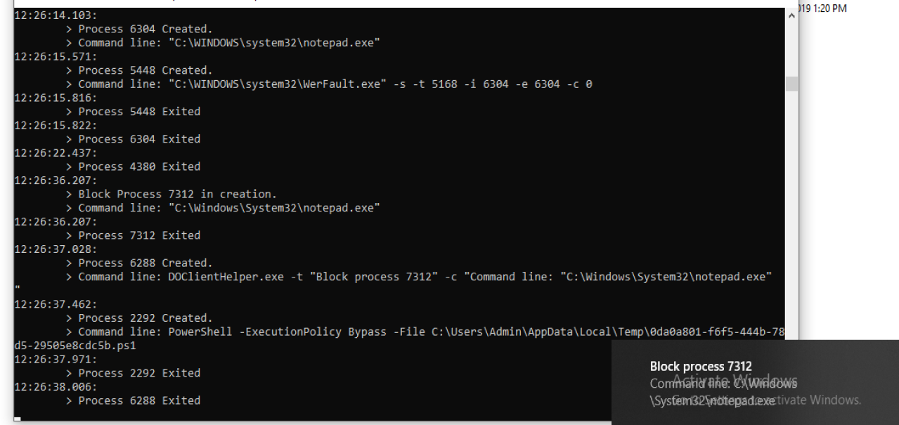

# Deep Ocean Solution

## Tl;dr
- Simple project in `Windows 10 x64 architecture` contains `kernel driver` and `user mode client` for viewing `process creation/destruction notification` and preventing program paths if needed.
- Feel free to leave a star and fork the repo for a quick start up with Windows Kernel Driver.

## Overview
- This repo represents our School Project for Course `System Programming` in `RHUST`. Therefore, the main goal is to revise & share knowledge with system internals and kernel driver, specifically.
- The project is named after the idea of digging inside the `Windows internal system`. The default Windows screen is blue, the death screen is also blue and what we do is also diving in this deep Windows ocean. On the other hand, the project name also represents the deep work of students who trying their best to achieve success and be better their `yesterdays`. 
- In this project, we demonstrated a nice solution to monitor process creation in Windows. In details, we registered process creation/destruction notifications via `PsSetCreateProcessNotifyRoutineEx` in kernel mode. Therefore, we could view all informations about process creation & destruction in real-time. In user mode, we set up a client to print notifications that are from kernel driver to console. Nevertheless, we added up a feature that allow blocking program by path. Client in user mode can prevent any program from running by sending a blacklist to the driver in kernel mode. Then the driver will continuous check if any process creation starts from any path existing in the blacklist. There are 2 important things related to this feature. First, driver needs to compare paths insensitively. Second, driver should consider a mechanism to prevent the case the program changes its name. However, in this project, we only took the first case seriously and considered the second case as unpreventable. Overall, the contributions in this project are as follows:
	+ Kernel Driver regists for process creation/destruction notifications
	+ User mode Client communicate with kernel driver for logging purpose and send list of blocking program path
	+ User mode Helper helps user mode client in posting toast notification

## Architecture
- A driver (`deocdrv.sys`) set up in kernel mode for retrieving any process creation/destruction notifications and blocking any process creation if its path existed in blacklist.
	+ The driver is written in Cpp and targets `Windows 10`. Its main idea is for debugging purpose, but not production!
- An executable (`DOClient.exe`) set up in user mode for logging process creation/destruction notifications and sending blocking program path to our kernel driver. The client is written in Cpp.
	+ This Client logs process creation/destruction notifcations in console
	+ This Client also post a toast notification whenever a program is blocked from running.
- A client helper (`DOClientHelper.exe`) set up in user mode for posting toast notification containing information sent from client executable
	+ This client helper is quickly written in Golang.
- Both of these modules are targetting `x64 architecture` of Windows.

## Project Structure
- Basically, Deep Ocean Solution is divided in 2 main modules which are  DODriver and DOClient along with a helper module: DOClientHelper. More details about code has been written inside `Document` folder. Therefore, we just highlights flows and architecture of this solution.
- The root of repository includes a solution file `Deep Ocean Driver.sln` which helps monitoring multiple projects (in this case is DOClient and DODriver).

### DODriver Module
- The driver regists `PsSetCreateProcessNotifyRoutineEx` for process creation/destruction notifications with function `OnProcessNotify`. This makes `OnProcessNotify` as a additional routine that system needs to run whenever there is a process creation/destruction notification. In other words, `OnProcessNotify` will always receive every process creation/destruction notification sequentially. 
- Inside `OnProcessNotify`, we set up 2 cases corresponding to process creation and process destruction notification.
	+ With process destruction notification, we simply added the notification to a linked list (the head is `ProcNotiItemsHead` and the node type is `ProcessExitInfo`), which later be sent to client mode
	+ With process creation notification, we compared the process path (if there is) with all process paths in blacklist. If the process path exists in the blacklist linked list (the head is `ProgItemsHead` and the node type is `ProcessMonitorInfo`), the driver simply adds the notification to the linked list (the head is `ProcNotiItemsHead` and the node type is `ProcessCreateInfo`) and marks this notification as blocked
- Thanks to the great power of inheritance for struct in Cpp, `ProcessCreateInfo` and `ProcessExitInfo` can inherits a same parent `ItemHeader`. Therefore, we could simply added both process creation and destruction notification to a same linkedlist, whose head is `ProcNotiItemsHead`.
- To communicate with client user mode, we use 2 main methods: `Direct I/O` and `Buffered I/O`.
	+ We use `direct I/O` for quickly writing notifications to the same memory that client provides
	+ The buffered I/O is used for receiving commands from cient
		+ Driver receives `IOCTL_DO_PROGRAM_BLOCK` as blocking the program by path. Whenever this `IOCTL` comes, the driver will store it inside the above blacklist linked list. 
		+ For `IOCTL_DO_PROGRAM_UNBLOCK`, driver will remove the requested program path from the blacklist

### DOClient Module
- In module DOClient, we setup class `KernelGateway` (inside `kernelgateway.h` and `kernelgateway.cpp`) which is responsible for communicating with kernel driver. 
- As mentioned, to communicate with kernel driver, user mode client are required to support both `Direct I/O` (using `ReadFile` indicates the right handle to Deep Ocean driver device) and `Buffered I/O` (using `DeviceIoControl` indicates the correct handle to driver device and the demanding IOCTL).
- To avoid duplicate code, we setup a shared library (`DODriver/drivercommon.h`) to help both kernel driver and user mode client unify the same data type and protocol to communicate.
- Whenever DOClient receives a process creation notifcation containing blocked status, it will call DOClientHelper for posting toast notification (for better UI)

### DOClientHelper Module
- This simple module contains a single `main.go` to receive arguments and pass it to a simple toast notification
- It uses library `argparse` and `toast.v1`

### Side Folders
- Kernel Driver file (`deocdrv.sys`) and user mode client (`DOClient.exe`) should be inside `x64\Debug`
	+ We ignored to push this path to github repository, but you can simply obtain it by building solution (`Deep Ocean Driver.sln`). The `Visual Studio` will generate the binaries and put them in the right folder.
- Client Helper binary (`DOClientHelper.exe`) should be located in `DOClientHelper\Build`.
- For easy driver installation, we have put a folder named as `Driver Scripts` containing `install_driver.cmd` for registering`deoc` service with `deocdrv.sys` driver binary. On the other hand, script `uninstall_driver.cmd` is used to uninstall driver service.
- For easy grabbing essential binaries, we create `Binaries` folder containing script `AutoGetBin.cmd`. Click it and all required binaries (`deocdrv.sys`, `DOClient.exe`, `DOClientHelper.exe`, `install_driver.cmd` and `uninstall_driver.cmd`)will show up in the same place. What we need to do left is moving those binaries to a virtual machine and test them.
	+ Note that, to utilize the power of this script, location of each binary must be as mentioned above.
	+ Fortunately, we did keep demo binaries in this folder for fast testing purpose.

## Project Requirements
### Requirements for Running Deep Ocean Services
- Because binaries are not for production, modules should be installed in a virtual machine (or a real machine if you are rich). 
- Turn on debug mode using `bcdedit /debug on`
- Disable driver signature enforcement using
	```
	bcdedit /set loadoptions DDISABLE_INTEGRITY_CHECKS
	bcdedit.exe /set nointegritychecks on
	```
- In the end, restart machine so the above configurations would affect after that.

### Requirements for Debugging Deep Ocean Services
- Not only the above steps for running services are required, setting port for the machine is also essential to enable debugging.
- Currently, `Microsoft` supports both debugging on real machine and virtual machine. For the sake of simplicity, we only demonstrate the way to enable debugging in `VMWare`
- There are two common types of debugging which are local Kernel Debugging (LKD) and Full Kernel Debugging. LKD cannot help us in setting breakpoints (because when we reach breakpoint, the kernel is paused and LKD also freeze). Hence, we focus on setup 2 machines: 1 machine for setting `WinDbg`, 1 virtual machine to run services
- In host machine, we can either use `WindDbg preview` (recommended) or `WinDbg classical`. 
1. Configure `Windbg Preview`
- Launch the kernel debugger and select `File/Attach To Kernel`. Navigate to the `COM` tab and fill as follows:
	+ check `Pipe` and `Reconnect`
	+ choose `Resets` as 0
	+ choose `Baud Rate` as 115200
	+ Port as `\\.\pipe\com_1`
- After the VMware is setup nicely, we can press OK to start debugging.

2. Create pipe and virtual serial connection in VMware
- Edit virtual machine settings, create a serial port with name as `\\.\pipe\com_1`. Choose `Yield CPU on poll`
- Denote if the name of created device of `Serial Port 2`. The number of 2 may due to the printer is the first one
- Start machine, run cmd with Administrators. Input these commands (Remember debugport is 2 if the name of device is `Serial Port 2`)
    ```
    > bcdedit /debug on
    > bcdedit /dbgsettings serial debugport:2 baudrate:115200 /noumex
    > bcdedit /dbgsettings
    -------
    Result:
    debugtype               Serial
    debugport    2    
    baudrate    115200    
    noumex    Yes
    The operation completed successfully.
    -------
	```
- Restarting machine is also required.

### Requirements for Building Deep Ocean Services
- For DODriver and DOClient, developers needs `Visual Studio 2017 / 2019` (along with `C++ workload`), `Windows 10 SDK`, `Windows 10 Driver Kit (WDK)`
	+ After installing these prerequisites, `Empty WDM Driver` should appear a project template in `Visual Studio`

- For DOClientHelper, Golang is required to be installed (of course :v). `go mod` might take place to install the essential libraries.

## Project Build
- For DODriver and DOClient, simply click on `Deep Ocean Driver.sln` to open both projects for kernel driver and user mode client. 
	+ Choose debug and architecture `x64`
	+ Simply manually build solution or `Ctrl + Shift B` as shortcut
	+ Binaries will be allocated at `x64\Debug`
- For DOClientHelper, get into `DOClientHelper` and build the module using the following command: 
	```
	go build -o Build\DOClientHelper.exe
	```

## Project Run
- `DODriver` installation can be automated using `install_driver.cmd` script (inside `Driver Scripts` folder). On the other hand, script `uninstall_driver.cmd` is used for uninstallation
- `DOClient` currently supports logging notifications and add/remove blocking program list
	+ Block notepad: 
		```
		DOClient.exe -progblock C:\Windows\System32\notepad.exe
		```
	+ Unblock notepad: 
		```
		DOClient.exe -progunblock C:\Windows\System32\notepad.exe
		```
	+ View informations: 
		```
		DOClient.exe -procnoti
		```
	+ View usage: 
		```
		DOClient.exe -h
		```

# Demo
- POC of blocking notepad: 
	

- Other pocs can be seen in `Document` folder

# Reference
- Windows Kernel Programming Book by Pavel Yosifovich
- https://www.triplefault.io/2017/07/setting-up-kernel-debugging-using.html (for setting up kernel debugging using WinDbg and VMware)
- https://www.osr.com/getting-started-writing-windows-drivers/
- Windows Internals 7th Edition — Part 1
- Windows System Programming 4th Edition
- https://github.com/microsoft/Windows-driver-samples
- http://www.osronline.com/article.cfm%5Earticle=499.htm (Windows Doubly Linked List basic concepts)
- https://osm.hpi.de/research/WRK/2009/07/single_list_entry-containing_record/ (Windows Doubly Linked List essential functions)
- https://www.codeproject.com/Articles/800404/Understanding-LIST-ENTRY-Lists-and-Its-Importance (Windows Linked List and windbg tutorial)
- https://dennisspan.com/analyzing-system-crashes-on-non-persistent-machines/ (analyze system crash on machines)
